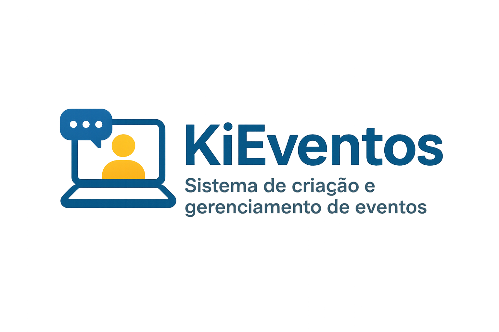

## Objetivo:
Sistema para criação e gerenciamento de eventos (presenciais ou online), com funcionalidades de inscrição, networking entre participantes, recomendações personalizadas de palestras e análise de engajamento. Também permitir a avaliação dos eventos pelos participantes, coletas de retorno dos participantes, canal de comunicação com os envolvidos e integração com redes sociais. 

## Alunos:
- Anny Vitoria Costa - Júnior - annycosta@alunos.utfpr.edu.br
- Ana Beatriz Maciel Ferraz - Pleno- anaferraz@alunos.utfpr.edu.br 
- Álefh Trindade Luz de Lima - Júnior - alefhlima@alunos.utfpr.edu.br 
- Pedro Augusto da Silva Morais - Júnior - pedroaugustomorais@alunos.utfpr.edu.br 
- Fábio Massashi Suzuki - Júnior - suzukif.2023@alunos.utfpr.edu.br 
- Vitor Barbosa Hilário - Pleno - vitorhilario@alunos.utfpr.edu.br
- Gabriel Batistela da Silva

## ***Requisitos funcionais***

|Identificador| Descrição| Prioridade|
| -------- | -------- | -------- |
|RF01|
|RF02|
|RF03|
|RF04|
|RF05|
|RF06|
|RF07|
|RF08|
|RF09|
|RF10|
|RF11|
|RF12|
|RF13|
|RF14|
|RF15|
|RF16|
|RF17|
|RF18|
|RF19|
|RF20|

## ***Requisitos não funcionais***

|Identificador| Descrição| Tipo|
| -------- | -------- | -------- |
|RNF01|
|RNF02|
|RNF03|
|RNF04|
|RNF05|
|RNF06|
|RNF07|
|RNF08|
|RNF09|
|RNF10|
|RNF11|
|RNF12|
|RNF13|
|RNF14|
|RNF15|
|RNF16|
|RNF17|
|RNF18|
|RNF19|
|RNF20|
